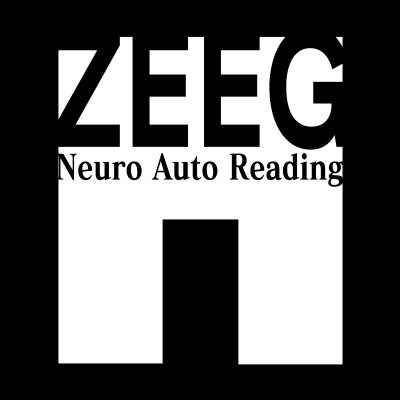

# ZEEG - Neuro Auto Reading

***ZEEG (Z? Entropic Encephalus Gram) è un elettro encefalo gramma progettato, costruito e testato da me***.  
Lo scopo è quello di creare una macchina quanto più precisa e attendibile possibile utilizzando materiali fai da te e componenistica accessibile. Nella repository si troveranno tutte le componenti essenziali per costruire la macchina. 
Un'altro scopo è quello di poter osservare le interazioni nervose (misurabili) del cervello per auto-indagare sul proprio stato mentale (da qui viene Auto Reading).  

## Tabella dei Contenuti
* [Introduzione](#introduzione)
* [Panoramica](#Panoramica)
  + [Piano del Progetto](#Piano-del-Progetto)
  + [Fattibilità](#fattibilità)
  + [Costi (in aggiornamento)](#costi)
  + [Futuro](#futuro)
* [Software](#software)
  + [Ambiente](#software-ide)
  + [Lettura](#software-lettura)
  + [Elaborazione](#software-elaborazione)

## Introduzione
Ciao, sono Roberto, e ho 18 anni. Dopo una sincope (che mi ha destabilizzato) mi sono chiesto cosa accada nel mio cervello e, nel caso, cosa scaturisca a livello nervoso il mio stile di vita. La creazione dello ZEEG è sicuramente frutto di una fervente passione, **scientifica** ed **introspettiva**. 
Il progetto è appogiato su discrete basi tecniche ma scarse conoscenze di medicina, cosa che mi rende felice perchè mi da l'occasione di studiare una branca del corpo umano da cui sono sempre stato profondamente affascinato. Lo ZEEG verrà testato su di me e su chiunque voglia provarlo, ma il focus centrale del progetto sono io (chiedo venia per l'ego). Il mio obiettivo sarebbe anche quello di poter leggere il risultato dell'eeg e poterlo convertire in stati discreti.  
La struttura è basata su questo principio:
* Per ***stato discreto*** si intende un corollario di segnali nervosi identificabile in tre principali macro-aree di stimolazione: 
  - Fisiologica (Sonno, Veglia, Dolore)
  - Cognitiva (Concetrazione, Lettura, Ragionamento)
  - Emotiva (Rabbia, Gioia, Tristezza)

Tale struttura però è ancora prototipica perchè non ha nessun sostegno chiaro dal punto di vista scientifico.  
Un'altro tema su cui mi piacerebbe indagare è il ruolo della religione e della dottrina sul comportamento del cervello e vorrei studiare i possibili effetti che hanno la preghiera e la fede sul cervello umano. Se tali abitudini e *stati mentali* hanno un'effetto così fenomenologicamente osservabile (dal punto di vista psicologico) all'esterno, ***mi aspetto che vi sia un'evidenza misurabile anche sotto al tappeto***.

## Panoramica
Questa sezione tratterà della gestione più generale possibile del lavoro. Occorre precisare che nessuna azienda o organizzazione finanzia il progetto, tantomeno qualche collaboratore. Ogni sezione, all'alpha all'omega del progetto è interamente curata da me. La panoramica servirà quindi a dare una rapida occhiata alla materia del progetto, a partire da come è progettato fino alle considerazioni personali e previsioni future. I costi saranno un tema in divenire, cambiando in base alla scelta dei materiali a seconda della release.

### Piano del progetto
Lo ZEEG disporra di tre parti principali:
- ***La cuffia e gli elettrodi***
- ***L'elettronica di condizionamento ed acquisizione***
- ***Il computer di bordo per l'elaborazione e l'interfaccia utente***
  
L'alimentazione sarà cablata e prevedo bassissimi consumi. La cuffia sarà una parte critica: Comprarla oppure costruirla? 
Nel secondo caso devo ingegnarmi per trovare un modo per stampare in 3d una struttura indossabile che sia comoda per ore. Probabilmente non sarà solo plastica.
Un'altro desiderio è quello di poter rendere lo ZEEG portatile e poterlo testare in un ciclo di 24h per studiare il cervello sotto un corollario quanto più completo di stimoli.

Lo ZEEG sarà un sistema fortemente standalone disponendo di un computer già a bordo. Occorre precisare però che solo la lettura e l'elaborazione dell'eeg sarà possibile. La definizione degli stati nervosi sarà indissolubilmente legata a terminali più potenti e configurati, necessitando di modelli di reti neurali piuttosto complessi. Nulla esclude una futura modifica alla pagina riuscendo a delegare l'elaborazione degli stati discreti al computer di bordo dello ZEEG.

# Software

#### Software IDE
  
